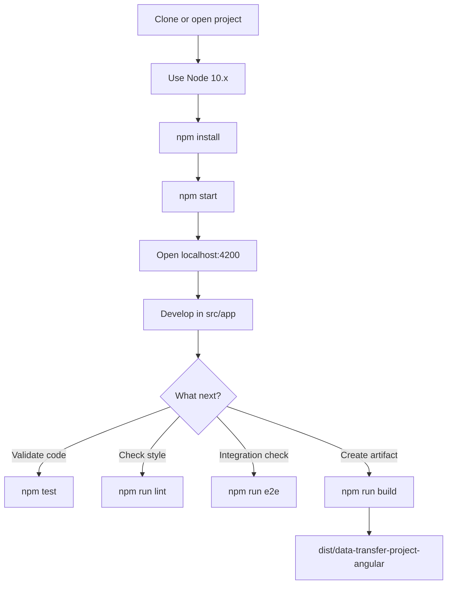
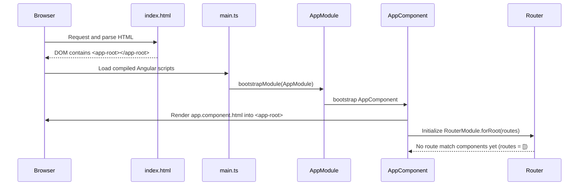

# DataTransferProjectAngular (Angular 6)

This project was generated with Angular CLI `6.2.9`.

## Prerequisites

- Node.js `10.x` (your terminal currently uses `10.24.1`)
- npm `6.x`

## How to Start This Project

From the project root:

```bash
nvm use 10.24.1
npm install
npm start
```

Then open:

- http://localhost:4200/

`npm start` runs `ng serve` and enables live reload for changes under `src/`.

## Common Commands

- `npm start` -> Run development server
- `npm run build` -> Build app in `dist/data-transfer-project-angular`
- `npm run build -- --prod` -> Production build
- `npm test` -> Unit tests (Karma + Jasmine)
- `npm run lint` -> Lint TypeScript files
- `npm run e2e` -> End-to-end tests (Protractor)

## Angular 6 Workflow Diagram



## In-Depth Runtime Workflow (How It Loads in DOM)

This section describes the actual runtime order for this project.

### 1) Browser loads `index.html` first

- Entry HTML is defined in `angular.json` as `src/index.html`.
- The browser parses this file and finds:
	- `<base href="/">`
	- `<app-root></app-root>` (placeholder host element)
- At this point, no Angular component is rendered yet. Only the host element exists in DOM.

### 2) Angular main bundle starts from `src/main.ts`

- `main.ts` is configured as the `main` entry in `angular.json`.
- Startup sequence in `main.ts`:
	- imports `AppModule`
	- reads `environment.production`
	- calls `platformBrowserDynamic().bootstrapModule(AppModule)`

### 3) Root module initialization (`AppModule`)

- `AppModule` is loaded from `src/app/app.module.ts`.
- Angular registers declarations/imports/providers from `@NgModule(...)` metadata.
- `bootstrap: [AppComponent]` tells Angular which component to instantiate first.

### 4) First component render (`AppComponent`)

- Angular creates `AppComponent` (from `src/app/app.component.ts`).
- The component selector is `app-root`.
- Angular matches selector `app-root` to existing `<app-root>` in `index.html`.
- Angular replaces/enhances that host element content with `app.component.html` template output.

### 5) Template and change detection

- `app.component.html` is evaluated.
- Template binding like `{{ title }}` reads value from `AppComponent.title`.
- Angular change detection updates DOM whenever bound state changes.

### 6) Router stage in this project

- `AppRoutingModule` is imported in `AppModule`.
- Current route table (`src/app/app-routing.module.ts`) is empty: `const routes: Routes = [];`
- `router-outlet` exists in `app.component.html`, but with no configured routes, no routed component is injected yet.
- If routes are added later, router will render matched components inside `<router-outlet></router-outlet>`.

## Component Render Order (Current State)

For the exact code currently in this project, render order is:

1. `src/index.html` loads and creates static `<app-root>`.
2. `src/main.ts` bootstraps Angular with `AppModule`.
3. `src/app/app.module.ts` bootstraps `AppComponent`.
4. `src/app/app.component.ts` is instantiated.
5. `src/app/app.component.html` is rendered into `<app-root>`.
6. `<router-outlet>` remains empty until routes are defined.

## Detailed Render/Boot Diagram



## Folder Structure (Detailed)

```text
data-transfer-project-angular-06/
|-- angular.json                 # Angular CLI workspace config (build/serve/test/lint targets)
|-- package.json                # npm scripts + dependencies
|-- tsconfig.json               # Base TypeScript config
|-- tslint.json                 # Root TSLint config
|-- README.md                   # Project documentation
|-- e2e/                        # End-to-end test project (Protractor)
|   |-- protractor.conf.js      # Protractor runner config
|   |-- tsconfig.e2e.json       # TS config for e2e tests
|   `-- src/
|       |-- app.e2e-spec.ts     # e2e test specs
|       `-- app.po.ts           # Page object for e2e tests
`-- src/                        # Application source
		|-- index.html              # Host page containing <app-root>
		|-- main.ts                 # Angular bootstrap entry point
		|-- polyfills.ts            # Browser polyfills for Angular
		|-- styles.css              # Global styles
		|-- test.ts                 # Unit test bootstrap file
		|-- browserslist            # Browser compatibility target list
		|-- karma.conf.js           # Karma unit test runner config
		|-- tsconfig.app.json       # TS config for app build
		|-- tsconfig.spec.json      # TS config for unit tests
		|-- tslint.json             # TSLint config scoped to src/
		|-- assets/                 # Static assets copied as-is
		|-- environments/           # Environment variables by build mode
		|   |-- environment.ts      # Development environment
		|   `-- environment.prod.ts # Production environment
		`-- app/                    # Root application module/components
				|-- app.module.ts       # Root NgModule
				|-- app-routing.module.ts # Router configuration
				|-- app.component.ts    # Root component class
				|-- app.component.html  # Root component template
				|-- app.component.css   # Root component styles
				`-- app.component.spec.ts # Root component unit tests
```

## Build and Runtime Pipelines (What Runs When)

### Development (`npm start`)

1. Angular CLI reads `angular.json` `serve` target.
2. Dev server starts and points to `build` target.
3. TypeScript is compiled (JIT mode by default in Angular 6 dev serve).
4. Bundles are served from memory.
5. Browser loads app and bootstrap/render flow runs.
6. On file changes, CLI rebuilds and triggers live reload.

### Production (`npm run build -- --prod`)

1. CLI uses `build.configurations.production` from `angular.json`.
2. Replaces `src/environments/environment.ts` with `src/environments/environment.prod.ts`.
3. Enables AOT + optimization + build optimizer + output hashing.
4. Emits static build output to `dist/data-transfer-project-angular`.

## How Next Components Render in Future

When you add new components, they can appear in two main ways:

1. Static nesting:
	 - Add selector (example `<app-child></app-child>`) inside `app.component.html`.
	 - Angular renders child component during parent template evaluation.

2. Route-driven rendering:
	 - Add route in `app-routing.module.ts`:
		 - example `{ path: 'users', component: UsersComponent }`
	 - Navigate to `/users`.
	 - Router injects `UsersComponent` view into `<router-outlet>`.

## Scaffolding

Generate new code with Angular CLI, for example:

```bash
ng generate component my-component
```

You can also generate directive, pipe, service, class, guard, interface, enum, or module.
