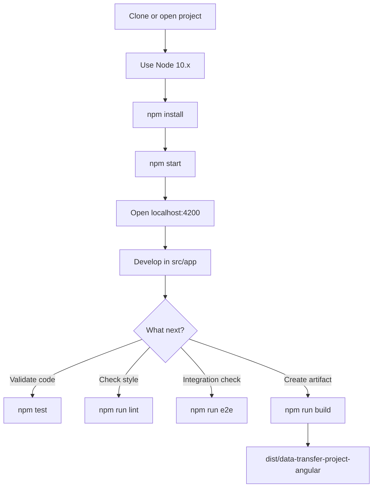

# DataTransferProjectAngular (Angular 6)

This project was generated with Angular CLI `6.2.9`.

## Prerequisites

- Node.js `10.x` (your terminal currently uses `10.24.1`)
- npm `6.x`

## How to Start This Project

From the project root:

```bash
nvm use 10.24.1
npm install
npm start
```

Then open:

- http://localhost:4200/

`npm start` runs `ng serve` and enables live reload for changes under `src/`.

## Common Commands

- `npm start` -> Run development server
- `npm run build` -> Build app in `dist/data-transfer-project-angular`
- `npm run build -- --prod` -> Production build
- `npm test` -> Unit tests (Karma + Jasmine)
- `npm run lint` -> Lint TypeScript files
- `npm run e2e` -> End-to-end tests (Protractor)

## Angular 6 Workflow Diagram



## Project Structure (Quick View)

- `src/main.ts`: Bootstraps Angular app
- `src/app/app.module.ts`: Root module
- `src/app/app-routing.module.ts`: Route definitions
- `src/environments/`: Environment configs
- `angular.json`: CLI build/serve/test configuration

## Scaffolding

Generate new code with Angular CLI, for example:

```bash
ng generate component my-component
```

You can also generate directive, pipe, service, class, guard, interface, enum, or module.
